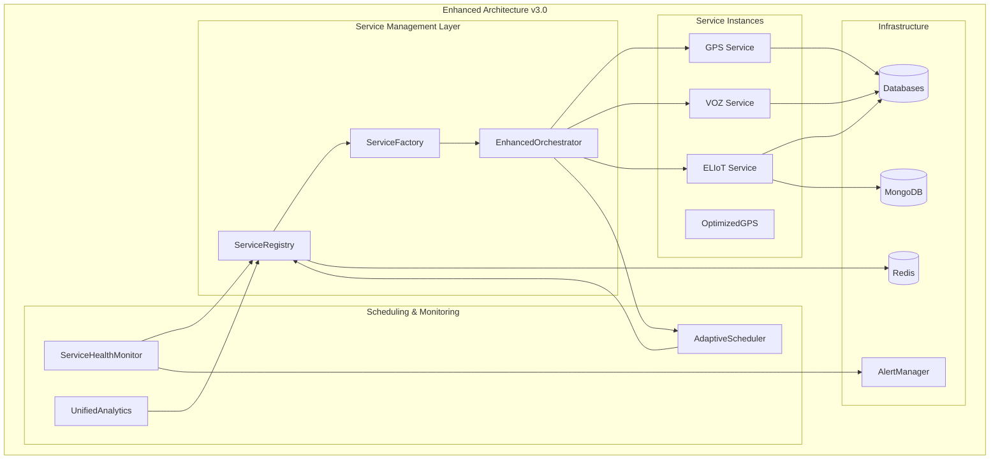

# Enhanced Service Architecture Guide

## Overview

The Enhanced Service Architecture represents a comprehensive evolution of the recharge system from a simple three-service orchestrator to a sophisticated, enterprise-grade microservices platform. This architecture provides dynamic service management, intelligent scheduling, comprehensive monitoring, and advanced analytics capabilities.

## Table of Contents

1. [Architecture Overview](#architecture-overview)
2. [Core Components](#core-components)
3. [Service Management](#service-management)
4. [Deployment Guide](#deployment-guide)
5. [Configuration](#configuration)
6. [Monitoring and Observability](#monitoring-and-observability)
7. [Development Guide](#development-guide)
8. [Best Practices](#best-practices)
9. [Troubleshooting](#troubleshooting)
10. [API Reference](#api-reference)

## Architecture Overview

### Design Principles

The enhanced architecture is built on the following principles:

- **Service Autonomy**: Each service operates independently with its own lifecycle
- **Dynamic Orchestration**: Services are created, managed, and destroyed dynamically
- **Observability**: Comprehensive monitoring and analytics across all services
- **Resilience**: Built-in fault tolerance and recovery mechanisms
- **Scalability**: Horizontal and vertical scaling capabilities
- **Backward Compatibility**: Legacy mode supports existing workflows

### Architecture Diagram



### Key Improvements

| Feature | Legacy (v2.0) | Enhanced (v3.0) |
|---------|---------------|-----------------|
| Service Management | Static processors | Dynamic service registry |
| Scheduling | Fixed intervals | Adaptive scheduling |
| Monitoring | Basic health checks | Comprehensive monitoring |
| Analytics | Per-service reports | Unified cross-service analytics |
| Scaling | Manual | Automatic with load balancing |
| Configuration | Hard-coded | Architecture-driven |
| Error Handling | Basic retry | Circuit breakers & recovery |
| Testing | Limited | Comprehensive integration tests |

## Core Components

### 1. ServiceRegistry

Central registry for all service types and instances.

**Location**: `lib/services/ServiceRegistry.js`

**Key Features**:
- Service type registration and discovery
- Instance lifecycle management
- Health status tracking
- Performance metrics collection
- Load balancing and optimal instance selection

**Usage Example**:
```javascript
const serviceRegistry = new ServiceRegistry();

// Services are auto-registered from config
const gpsService = serviceRegistry.getOptimalService('gps');
const health = serviceRegistry.getServiceHealth('gps');
```

### 2. ServiceFactory

Dynamic service instantiation with dependency injection.

**Location**: `lib/services/ServiceFactory.js`

**Key Features**:
- Dynamic service creation
- Dependency injection and validation
- Configuration merging
- Instance pooling and reuse
- Service clustering for scaling

**Usage Example**:
```javascript
const serviceFactory = new ServiceFactory(serviceRegistry, dependencies);

// Create single instance
const gpsInstance = await serviceFactory.createService('gps', customConfig);

// Create cluster for scaling
const cluster = await serviceFactory.createServiceCluster('gps', 3);
```

### 3. EnhancedOrchestrator

Advanced orchestration with performance monitoring and circuit breakers.

**Location**: `lib/orchestration/EnhancedOrchestrator.js`

**Key Features**:
- Service execution with monitoring
- Circuit breaker pattern
- Concurrent execution management
- Performance tracking
- Automatic recovery

**Usage Example**:
```javascript
const orchestrator = new EnhancedOrchestrator(options);
await orchestrator.initialize(dependencies);

// Execute service with monitoring
const execution = await orchestrator.startService('gps');
```

### 4. AdaptiveScheduler

Intelligent scheduling that adapts based on performance and load.

**Location**: `lib/scheduling/AdaptiveScheduler.js`

**Key Features**:
- Adaptive interval adjustment
- Load-based scheduling
- Peak/off-peak optimization
- Resource contention resolution
- Performance-based scaling

**Usage Example**:
```javascript
const scheduler = new AdaptiveScheduler(serviceRegistry);

// Schedule with adaptive configuration
const scheduleId = await scheduler.scheduleService('gps', {
    type: 'adaptive',
    baseMinutes: 10
});
```

### 5. ServiceHealthMonitor

Comprehensive health monitoring with incident detection.

**Location**: `lib/monitoring/ServiceHealthMonitor.js`

**Key Features**:
- Real-time health monitoring
- Incident detection and tracking
- Automated recovery attempts
- SLA compliance monitoring
- Performance trend analysis

**Usage Example**:
```javascript
const healthMonitor = new ServiceHealthMonitor(serviceRegistry, alertManager);
await healthMonitor.startMonitoring();

const healthReport = healthMonitor.getHealthReport();
```

### 6. UnifiedServiceAnalytics

Cross-service analytics and business intelligence.

**Location**: `lib/analytics/UnifiedServiceAnalytics.js`

**Key Features**:
- Cross-service correlation analysis
- Business intelligence insights
- Predictive analytics
- Financial metrics
- Unified reporting

**Usage Example**:
```javascript
const analytics = new UnifiedServiceAnalytics(dbConnections, serviceRegistry);

// Generate comprehensive report
const report = await analytics.generateUnifiedReport('monthly');

// Real-time dashboard
const dashboard = await analytics.getRealTimeDashboard();
```

## Service Management

### Service Lifecycle

1. **Registration**: Services are registered in the ServiceRegistry with metadata
2. **Instantiation**: ServiceFactory creates instances with proper dependencies
3. **Execution**: EnhancedOrchestrator manages execution with monitoring
4. **Monitoring**: ServiceHealthMonitor tracks health and performance
5. **Scaling**: Automatic scaling based on load and performance
6. **Termination**: Graceful shutdown with resource cleanup

### Service Types

#### GPS Service
- **Purpose**: GPS device recharge processing
- **Pattern**: Multi-instance with load balancing
- **Scheduling**: Adaptive intervals (default: 10 minutes)
- **Optimization**: OptimizedGPSProcessor available for performance

#### VOZ Service
- **Purpose**: Voice service recharge processing
- **Pattern**: Single-instance
- **Scheduling**: Fixed times (1:00 AM, 4:00 AM) or interval-based
- **Features**: Package-based recharges with provider balancing

#### ELIoT Service
- **Purpose**: IoT device recharge processing
- **Pattern**: Multi-instance
- **Scheduling**: Adaptive intervals (default: 10 minutes)
- **Dependencies**: MongoDB for metrics filtering

### Configuration Management

Services are configured through multiple layers:

1. **Base Configuration**: `config/services.js`
2. **Architecture Configuration**: `config/architecture.js`
3. **Environment Variables**: Runtime overrides
4. **Custom Configuration**: Per-instance settings

## Deployment Guide

### Prerequisites

- Node.js 16+ with npm
- MySQL databases (GPS_DB, ELIOT_DB)
- Redis server
- MongoDB (for ELIoT service)

### Installation

1. **Clone and Install**:
```bash
git clone <repository>
cd recargas-optimizado
npm install
```

2. **Environment Configuration**:
```bash
cp .env.example .env
# Configure database connections and API keys
```

3. **Architecture Configuration**:
```bash
# Enable enhanced architecture (default)
export USE_ENHANCED_ARCHITECTURE=true

# Configure deployment strategy
export DEPLOYMENT_STRATEGY=production

# Enable feature flags
export FEATURE_ADAPTIVE_SCHEDULING=true
export FEATURE_AUTO_SCALING=true
```

### Deployment Modes

#### Development Mode
```bash
export NODE_ENV=development
export USE_ENHANCED_ARCHITECTURE=true
npm start
```

#### Production Mode
```bash
export NODE_ENV=production
export DEPLOYMENT_STRATEGY=production
npm run pm2:start
```

#### Legacy Mode
```bash
export USE_ENHANCED_ARCHITECTURE=false
npm start
```

### Docker Deployment

```dockerfile
FROM node:16-alpine
WORKDIR /app
COPY package*.json ./
RUN npm ci --only=production
COPY . .
EXPOSE 3000
CMD ["npm", "start"]
```

## Configuration

### Architecture Configuration

The `config/architecture.js` file defines the complete system architecture:

```javascript
// Service architecture patterns
architecturePatterns: {
    'single_instance': { instanceCount: 1, loadBalancing: false },
    'multi_instance': { instanceCount: 3, loadBalancing: true },
    'clustered': { instanceCount: 5, clustering: true }
}

// Service assignments
serviceArchitectures: {
    'gps': { pattern: 'multi_instance', priority: 'high' },
    'voz': { pattern: 'single_instance', priority: 'medium' },
    'eliot': { pattern: 'multi_instance', priority: 'medium' }
}
```

### Resource Allocation

```javascript
resourceClasses: {
    'standard': {
        cpu: { min: 0.2, max: 1.0, target: 0.5 },
        memory: { min: '256MB', max: '1GB', target: '512MB' },
        connections: { database: 5, redis: 2 }
    }
}
```

### Environment-Specific Configuration

```javascript
environments: {
    development: {
        resourceAllocation: { /* reduced resources */ },
        monitoring: { metrics: { interval: '60s' } }
    },
    production: {
        security: { network: { tls: { enabled: true } } },
        monitoring: { metrics: { interval: '15s' } }
    }
}
```

## Monitoring and Observability

### Health Monitoring

The system provides three levels of health monitoring:

1. **Service-Level**: Individual service health and performance
2. **System-Level**: Overall system health and resource utilization
3. **Business-Level**: SLA compliance and business metrics

### Metrics Collection

Key metrics collected:

- **Performance**: Response time, throughput, error rate
- **Resource**: CPU, memory, connection usage
- **Business**: Success rate, revenue, customer satisfaction
- **Operational**: Uptime, incident count, recovery time

### Alerting

Multi-channel alerting system:

- **Critical**: Immediate alerts via PagerDuty, SMS
- **Warning**: Slack notifications, email
- **Info**: Email summaries, dashboard updates

### Analytics Dashboard

Real-time dashboard provides:

- Service status overview
- Performance trends
- Resource utilization
- Incident timeline
- Business KPIs

## Development Guide

### Creating New Services

1. **Create Processor Class**:
```javascript
class MyServiceProcessor extends BaseRechargeProcessor {
    getServiceType() {
        return 'myservice';
    }

    async processRecharges() {
        // Implementation
    }
}
```

2. **Register in ServiceFactory**:
```javascript
// Add to processorMappings in ServiceFactory
'myservice': {
    className: 'MyServiceProcessor',
    filePath: '../processors/MyServiceProcessor',
    requiredDependencies: ['dbConnection', 'lockManager']
}
```

3. **Configure Architecture**:
```javascript
// Add to config/architecture.js
serviceArchitectures: {
    'myservice': {
        pattern: 'single_instance',
        priority: 'low',
        resourceClass: 'standard'
    }
}
```

### Testing

Run comprehensive tests:

```bash
# Unit tests
npm run test:unit

# Integration tests
npm run test:integration

# Architecture tests specifically
npm test tests/integration/ServiceArchitecture.test.js

# Coverage
npm run test:coverage
```

### Development Tools

- **Hot Reload**: Enabled in development mode
- **Debugging**: Use `--inspect` flag for Node.js debugging
- **Profiling**: Enable with `PROFILING_ENABLED=true`

## Best Practices

### Service Design

1. **Single Responsibility**: Each service handles one specific domain
2. **Stateless Design**: Services should not maintain internal state
3. **Idempotent Operations**: Services should handle duplicate requests gracefully
4. **Error Handling**: Implement comprehensive error handling and recovery

### Performance Optimization

1. **Connection Pooling**: Use pooled database connections
2. **Caching**: Implement intelligent caching strategies
3. **Batch Processing**: Process records in batches when possible
4. **Resource Monitoring**: Monitor and optimize resource usage

### Security

1. **Input Validation**: Validate all input parameters
2. **Authentication**: Implement proper authentication mechanisms
3. **Encryption**: Encrypt sensitive data in transit and at rest
4. **Audit Logging**: Log all significant operations

### Monitoring

1. **Health Checks**: Implement comprehensive health checks
2. **Metrics Collection**: Collect relevant business and technical metrics
3. **Alerting**: Set up appropriate alerting thresholds
4. **Documentation**: Document all monitoring procedures

## Troubleshooting

### Common Issues

#### Service Registration Failures

**Symptoms**: Services not appearing in registry
**Solutions**:
- Check service configuration in `config/services.js`
- Verify `IMPLEMENTED` flag is not set to `false`
- Review ServiceRegistry initialization logs

#### Instance Creation Failures

**Symptoms**: ServiceFactory unable to create instances
**Solutions**:
- Verify all required dependencies are available
- Check processor class exports
- Review dependency injection configuration

#### Scheduling Issues

**Symptoms**: Services not executing on schedule
**Solutions**:
- Check AdaptiveScheduler configuration
- Verify timezone settings
- Review schedule job creation logs

#### Performance Degradation

**Symptoms**: Slow service execution
**Solutions**:
- Check resource utilization metrics
- Review database connection pool status
- Analyze query performance
- Consider enabling OptimizedGPSProcessor

#### Health Monitoring Alerts

**Symptoms**: Frequent health check failures
**Solutions**:
- Review service health check implementations
- Check dependency availability (database, Redis, etc.)
- Analyze error patterns in logs
- Adjust health check thresholds if needed

### Diagnostic Commands

```bash
# Check system status
npm run monitor

# View analytics
npm run analytics:single

# Check PM2 status (production)
npm run pm2:status

# View logs
npm run pm2:logs

# Test specific service
TEST_GPS=true npm start
```

### Log Analysis

Key log patterns to monitor:

```bash
# Service initialization
grep "initialized" logs/*.log

# Health check failures
grep "health.*failed" logs/*.log

# Performance issues
grep "slow.*query\|timeout" logs/*.log

# Circuit breaker events
grep "circuit.*breaker" logs/*.log
```

## API Reference

### ServiceRegistry API

```javascript
// Register service type
registerServiceType(serviceType, metadata)

// Register service instance
registerServiceInstance(serviceKey, instance, instanceId?)

// Get optimal service
getOptimalService(serviceType)

// Update health
updateServiceHealth(serviceKey, healthData)

// Get statistics
getStats()
```

### ServiceFactory API

```javascript
// Create service instance
createService(serviceType, customConfig?, instanceOptions?)

// Create service cluster
createServiceCluster(serviceType, instanceCount, customConfig?)

// Destroy service
destroyService(instanceId)

// Hot-swap service
hotSwapService(instanceId, newConfig?)
```

### EnhancedOrchestrator API

```javascript
// Initialize orchestrator
initialize(dependencies)

// Start service
startService(serviceType, customConfig?, options?)

// Schedule service
scheduleService(serviceType, scheduleConfig, customConfig?)

// Get statistics
getStats()

// Shutdown
shutdown()
```

### AdaptiveScheduler API

```javascript
// Schedule service
scheduleService(serviceType, customConfig?, options?)

// Cancel schedule
cancelSchedule(scheduleId)

// Get statistics
getSchedulerStats()

// Shutdown
shutdown()
```

### ServiceHealthMonitor API

```javascript
// Start monitoring
startMonitoring()

// Stop monitoring
stopMonitoring()

// Get health report
getHealthReport()

// Get statistics
getMonitoringStats()
```

### UnifiedServiceAnalytics API

```javascript
// Generate report
generateUnifiedReport(period?, includeComparisons?)

// Get real-time dashboard
getRealTimeDashboard()

// Export analytics
exportAnalytics(format?, period?)
```

## Migration Guide

### From Legacy to Enhanced Architecture

1. **Gradual Migration**:
   - Start with `USE_ENHANCED_ARCHITECTURE=false`
   - Enable enhanced features one by one
   - Monitor system behavior

2. **Configuration Updates**:
   - Review and update `config/architecture.js`
   - Set appropriate resource allocations
   - Configure monitoring thresholds

3. **Testing**:
   - Run integration tests in both modes
   - Verify service compatibility
   - Test failover scenarios

### Environment Variables

```bash
# Architecture control
USE_ENHANCED_ARCHITECTURE=true|false

# Feature flags
FEATURE_ADAPTIVE_SCHEDULING=true|false
FEATURE_AUTO_SCALING=true|false
FEATURE_PERF_OPT=true|false

# Deployment strategy
DEPLOYMENT_STRATEGY=development|staging|production

# Monitoring
HEALTH_ALERTS_ENABLED=true|false
TRACING_ENABLED=true|false
```

## Conclusion

The Enhanced Service Architecture provides a robust, scalable, and observable platform for the recharge system. By leveraging modern microservices patterns, the architecture enables:

- **Operational Excellence**: Automated monitoring, alerting, and recovery
- **Performance**: Optimized resource utilization and intelligent scheduling
- **Reliability**: Circuit breakers, health checks, and graceful degradation
- **Scalability**: Dynamic scaling based on load and performance
- **Observability**: Comprehensive metrics, logging, and analytics

The architecture maintains backward compatibility while providing a clear path for modernization and growth.

---

**Document Version**: 1.0
**Last Updated**: September 2025
**Architecture Version**: v3.0 Enhanced